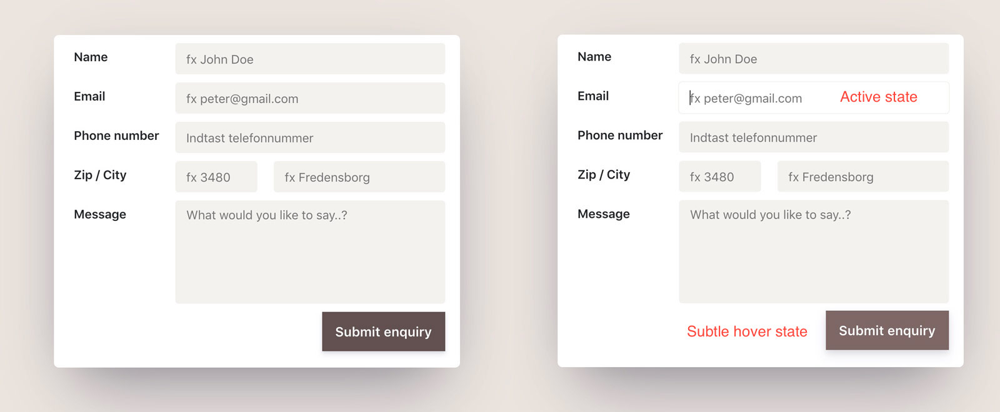

# Design challenge

## 07. Form

**Create the following layout:**

The main focus of this 20 minute design challenge is to style the form (`assets/index.html`), so that it looks somewhat like the following form. Notice the subtle details (e.g. drop shadows) and try to figure out how you would lay it out using flexbox or grid.

---

## Remember

This challenge contains some materials to get you started.  
Copy everything from the `assets` folder, to the `solution` folder.  
Use the terminal, and write: `cp ./assets/* ./solution/`

NB! Remember to copy it to the right folder.

And don't use more than 20 minutes on this challenge.
